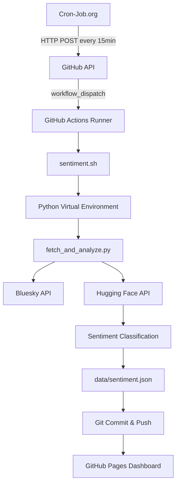

# 🌟 ReviewSky Sentiment Analysis

> **Automated cloud-based sentiment analysis of Bluesky reviews using deep learning models with zero-server architecture**

[](https://opensource.org/licenses/MIT)
[](https://www.python.org/downloads/)
[](https://github.com/features/actions)
[](https://cron-job.org/)

🔗 **[Live Dashboard](https://saintproject0.github.io/bluesky-sentiment-analysis/)**

---

## 🚀 Overview

ReviewSky is a **serverless sentiment analysis pipeline** that automatically:
- 🔄 Fetches real-time posts from Bluesky every 15 minutes
- 🧠 Analyzes sentiment using state-of-the-art Hugging Face models
- 📊 Updates an interactive dashboard with live insights
- 🎯 Categorizes content (Movies/TV, Books, Games, Music, Other)
- 💰 Runs completely **FREE** with zero maintenance

## ✨ Key Features

- **🌐 Serverless Architecture**: No servers to manage - runs entirely on GitHub Actions
- **🔄 Automated Pipeline**: Triggered every 15 minutes via Cron-Job.org
- **🤖 AI-Powered**: Uses RoBERTa-large sentiment model via Hugging Face API
- **📈 Real-time Dashboard**: Interactive charts and metrics via GitHub Pages
- **🏷️ Smart Categorization**: Automatic content classification
- **💾 Version Control**: All data changes tracked in Git
- **🔒 Secure**: Environment variables and secrets properly managed

## 🏗️ Architecture



## 📁 Project Structure

```
bluesky-sentiment-analysis/
├── 📄 sentiment.sh              # Main execution script
├── 🐍 fetch_and_analyze.py      # Data collection & analysis
├── 🌐 index.html               # Interactive dashboard
├── 📊 data/sentiment.json      # Generated sentiment data
├── ⚙️ .github/workflows/       # GitHub Actions configuration
└── 📖 README.md               # This file
```

## 🛠️ Setup & Installation

### Prerequisites
- GitHub account
- Bluesky account with app password
- Hugging Face account with API token
- Cron-Job.org account (free)

### 1. Fork & Clone Repository
```bash
git clone https://github.com/YourUsername/bluesky-sentiment-analysis.git
cd bluesky-sentiment-analysis
```

### 2. Configure GitHub Secrets
Navigate to `Settings > Secrets and variables > Actions` and add:

| Secret Name | Description |
|-------------|-------------|
| `BSKY_HANDLE` | Your Bluesky username (e.g., `user.bsky.social`) |
| `BSKY_APP_PASSWORD` | Generated app password from Bluesky settings |
| `HF_TOKEN` | Hugging Face API token for inference |

### 3. Enable GitHub Pages
1. Go to `Settings > Pages`
2. Source: `Deploy from a branch`
3. Branch: `main` / `root`
4. Save

### 4. Set Up Cron Trigger
1. Create account on [Cron-Job.org](https://cron-job.org/)
2. Create new cron job:
   - **URL**: `https://api.github.com/repos/YourUsername/bluesky-sentiment-analysis/actions/workflows/reviewsky-sentiment.yml/dispatches`
   - **Method**: POST
   - **Headers**: 
     ```
     Authorization: token YOUR_GITHUB_PAT
     Accept: application/vnd.github.v3+json
     ```
   - **Body**: `{"ref": "main"}`
   - **Schedule**: Every 15 minutes

## 🔧 Configuration

### Customize Data Sources
Edit `fetch_and_analyze.py` to modify:

```python
# Popular accounts to monitor
POPULAR_ACCOUNTS = [
    "jay.bsky.social",
    "bsky.app", 
    "paul.bsky.social"
]

# Keywords to search for
SEARCH_KEYWORDS = [
    "#review",
    "#bookreview", 
    "#moviereview",
    "#gamereviews"
]

# Limits
MAX_POSTS_PER_SOURCE = 15
BATCH_SIZE = 20
REQUEST_DELAY = 1  # seconds
```

### Modify Schedule
Change the cron expression in your Cron-Job.org dashboard:
- Every 5 minutes: `*/5 * * * *`
- Every hour: `0 * * * *`
- Daily at 9 AM: `0 9 * * *`

## 📊 Dashboard Features

The live dashboard includes:
- 📈 **Real-time Sentiment Counts**
- 🥧 **Sentiment Distribution Pie Chart**
- 📋 **Category Breakdown**
- 🕒 **Last Update Timestamp**
- 📱 **Mobile-Responsive Design**
- 🌙 **Dark/Light Mode Toggle**

## 🔍 How It Works

### 1. Data Collection
- Connects to Bluesky via AT Protocol API
- Fetches recent posts from popular accounts
- Searches for review-related hashtags
- Implements rate limiting and error handling

### 2. Sentiment Analysis
- Sends text batches to Hugging Face inference API
- Uses `cardiffnlp/twitter-roberta-base-sentiment-latest` model
- Returns confidence scores for positive/neutral/negative

### 3. Data Processing
- Deduplicates posts using URI hashing
- Categorizes content using keyword matching
- Maintains rolling window of 1,000 most recent posts
- Generates aggregate statistics

### 4. Storage & Visualization
- Saves results to `data/sentiment.json`
- Commits changes to Git for version control
- Dashboard auto-updates from latest JSON data

## 🚨 Troubleshooting

### Common Issues

**❌ GitHub Actions failing?**
- Check if secrets are properly set
- Verify Bluesky credentials are valid
- Ensure Hugging Face token has inference permissions

**❌ Cron job not triggering?**
- Verify GitHub Personal Access Token has `repo` and `workflow` scopes
- Check Cron-Job.org execution logs
- Test manual workflow dispatch in GitHub Actions

**❌ Dashboard not updating?**
- Ensure GitHub Pages is enabled
- Check if `sentiment.json` is being committed
- Clear browser cache

### Debug Mode
Enable detailed logging by setting debug flag in `fetch_and_analyze.py`:
```python
DEBUG = True  # Set to True for verbose output
```

## 📈 Performance Metrics

- **⚡ Execution Time**: ~2-3 minutes per run
- **💾 Data Usage**: <100KB per execution
- **🔄 Update Frequency**: Every 15 minutes
- **📊 Data Retention**: Latest 1,000 posts
- **💰 Cost**: $0 (within GitHub free tier)

## 🤝 Contributing

1. Fork the repository
2. Create feature branch (`git checkout -b feature/amazing-feature`)
3. Commit changes (`git commit -m 'Add amazing feature'`)
4. Push to branch (`git push origin feature/amazing-feature`)
5. Open a Pull Request

## 📄 License

This project is licensed under the MIT License - see the [LICENSE](LICENSE) file for details.

## 🙏 Acknowledgments

- [Bluesky](https://bsky.social/) for the open AT Protocol API
- [Hugging Face](https://huggingface.co/) for democratizing AI model access
- [GitHub Actions](https://github.com/features/actions) for free CI/CD infrastructure
- [Cron-Job.org](https://cron-job.org/) for reliable scheduling service
- [Chart.js](https://www.chartjs.org/) for beautiful data visualization

---

<div align="center">

**⭐ Star this repo if you found it helpful!**

Made with ❤️ by [SAIntProject0](https://github.com/SAIntProject0)

</div>
